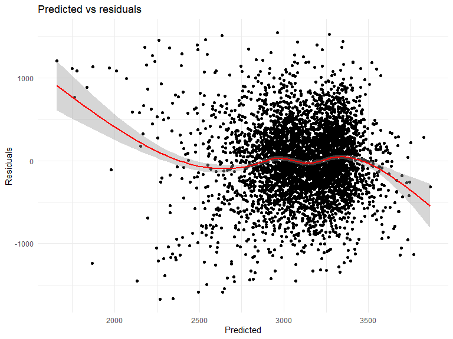

Homework 6
================
Ling Yi
11/24/2020

``` r
library(tidyverse)
```

    ## -- Attaching packages --------------------------------------- tidyverse 1.3.0 --

    ## v ggplot2 3.3.2     v purrr   0.3.4
    ## v tibble  3.0.1     v dplyr   1.0.2
    ## v tidyr   1.1.2     v stringr 1.4.0
    ## v readr   1.4.0     v forcats 0.5.0

    ## Warning: package 'tidyr' was built under R version 4.0.3

    ## Warning: package 'readr' was built under R version 4.0.3

    ## Warning: package 'dplyr' was built under R version 4.0.3

    ## -- Conflicts ------------------------------------------ tidyverse_conflicts() --
    ## x dplyr::filter() masks stats::filter()
    ## x dplyr::lag()    masks stats::lag()

``` r
library(modelr)

knitr::opts_chunk$set(
    echo = TRUE,
    warning = FALSE,
    fig.width = 8, 
  fig.height = 6,
  out.width = "90%"
)
options(
  ggplot2.continuous.colour = "viridis",
  ggplot2.continuous.fill = "viridis"
)
scale_colour_discrete = scale_colour_viridis_d
scale_fill_discrete = scale_fill_viridis_d
theme_set(theme_minimal() + theme(legend.position = "bottom"))
```

# Problem 1

``` r
homicide_df = 
  read_csv("data/homicide-data.csv", na = c("", "NA", "Unknown")) %>% 
  mutate(
    city_state = str_c(city, state, sep = ", "),
    victim_age = as.numeric(victim_age),
    resolution = case_when(
      disposition == "Closed without arrest" ~ 0,
      disposition == "Open/No arrest"        ~ 0,
      disposition == "Closed by arrest"      ~ 1)
  ) %>% 
  filter(
    victim_race %in% c("White", "Black"),
    city_state != "Tulsa, AL") %>% 
  select(city_state, resolution, victim_age, victim_race, victim_sex)
```

    ## 
    ## -- Column specification --------------------------------------------------------
    ## cols(
    ##   uid = col_character(),
    ##   reported_date = col_double(),
    ##   victim_last = col_character(),
    ##   victim_first = col_character(),
    ##   victim_race = col_character(),
    ##   victim_age = col_double(),
    ##   victim_sex = col_character(),
    ##   city = col_character(),
    ##   state = col_character(),
    ##   lat = col_double(),
    ##   lon = col_double(),
    ##   disposition = col_character()
    ## )

``` r
baltimore_df =
  homicide_df %>% 
  filter(city_state == "Baltimore, MD")

glm(resolution ~ victim_age + victim_race + victim_sex, 
    data = baltimore_df,
    family = binomial()) %>% 
  broom::tidy() %>% 
  mutate(
    OR = exp(estimate),
    CI_lower = exp(estimate - 1.96 * std.error),
    CI_upper = exp(estimate + 1.96 * std.error)
  ) %>% 
  select(term, OR, starts_with("CI")) %>% 
  knitr::kable(digits = 3)
```

| term              |    OR | CI\_lower | CI\_upper |
| :---------------- | ----: | --------: | --------: |
| (Intercept)       | 1.363 |     0.975 |     1.907 |
| victim\_age       | 0.993 |     0.987 |     1.000 |
| victim\_raceWhite | 2.320 |     1.648 |     3.268 |
| victim\_sexMale   | 0.426 |     0.325 |     0.558 |

``` r
models_results_df = 
  homicide_df %>% 
  nest(data = -city_state) %>% 
  mutate(
    models = 
      map(.x = data, ~glm(resolution ~ victim_age + victim_race + victim_sex, data = .x, family = binomial())),
    results = map(models, broom::tidy)
  ) %>% 
  select(city_state, results) %>% 
  unnest(results) %>% 
  mutate(
    OR = exp(estimate),
    CI_lower = exp(estimate - 1.96 * std.error),
    CI_upper = exp(estimate + 1.96 * std.error)
  ) %>% 
  select(city_state, term, OR, starts_with("CI")) 
```

``` r
models_results_df %>% 
  filter(term == "victim_sexMale") %>% 
  mutate(city_state = fct_reorder(city_state, OR)) %>% 
  ggplot(aes(x=city_state, y = OR))+
  geom_point()+
  geom_errorbar(aes(ymin = CI_lower, ymax = CI_upper)) +
  theme(axis.text.x = element_text(angle = 90, hjust = 1))
```


From this graph, we see that New York, NY has the lowest OR and a narrow
confidence interval while Albuquerque, NM has the highers OR and a
fairly wide confidence interval.

# Problem 2

Uploading the dataset, cleaning, and converting numerical varibles to
factors if needed. These variables include babysex, frace, mrace,
maform. There is no missing data.

``` r
child_df = 
  readr::read_csv("./data/birthweight.csv") %>%
  janitor::clean_names() %>%
    mutate(
    babysex = factor(babysex, labels = c("male", "female")),
    frace = factor(frace, levels = c(1, 2, 3, 4, 8, 9), labels = c("white", "black", "asian"," puerto_rican", "other", "unknown")),
   mrace = factor(mrace,  c(1, 2, 3, 4, 8, 9), labels = c("white", "black", "asian"," puerto rican", "other", "unknown")),
   malform = factor(malform, labels = c("absent", "present"))
     )
```

    ## 
    ## -- Column specification --------------------------------------------------------
    ## cols(
    ##   .default = col_double()
    ## )
    ## i Use `spec()` for the full column specifications.

``` r
sum(is.na(child_df))
```

    ## [1] 0

My proposed hypothesis states that factors affecting a baby’s
birth-weight includes gestational age in weeks, mother’s age at
delivery, mothers race, mother’s pre-pregnancy BMI, and family income.

``` r
fit = lm(bwt~ gaweeks + mrace + momage + ppbmi + fincome, data = child_df)
```

Plotting the predictions and residuals for the above model.

``` r
child_df %>%
  add_residuals(fit) %>%
  add_predictions(fit) %>%
  ggplot(aes(x = pred, y = resid)) + 
  geom_point()  + 
  geom_smooth(se = TRUE, color = "red") + 
  labs(title = "Predicted vs residuals", 
       x = "Predicted", 
       y = "Residuals")
```

    ## `geom_smooth()` using method = 'gam' and formula 'y ~ s(x, bs = "cs")'



Modeling length at birth and gestational age as predictors (main effects
only)

``` r
fit1 = lm(bwt~ blength + gaweeks, data = child_df)

broom::tidy(fit) %>% 
    knitr::kable()
```

| term               |      estimate |   std.error |    statistic |   p.value |
| :----------------- | ------------: | ----------: | -----------: | --------: |
| (Intercept)        |   535.4443528 | 103.3186652 |    5.1824552 | 0.0000002 |
| gaweeks            |    59.1633420 |   2.2056651 |   26.8233571 | 0.0000000 |
| mraceblack         | \-239.8594074 |  16.0937446 | \-14.9038905 | 0.0000000 |
| mraceasian         |  \-70.8729286 |  70.0746813 |  \-1.0113914 | 0.3118856 |
| mrace puerto rican | \-155.4724114 |  31.0321001 |  \-5.0100512 | 0.0000006 |
| momage             |   \-0.2382048 |   1.9546576 |  \-0.1218652 | 0.9030114 |
| ppbmi              |    15.8292187 |   2.1738673 |    7.2815937 | 0.0000000 |
| fincome            |     0.5582810 |   0.2936781 |    1.9009966 | 0.0573687 |

Modeling head circumference, length, sex, and all interactions
(including the three-way interactions) between these variables.

``` r
fit3 = lm(bwt~ bhead + blength + babysex + bhead*blength + bhead*babysex + blength*babysex + bhead*blength*babysex , data = child_df)
```

Cross validations with crossv\_mc

``` r
cv_child_df = 
  crossv_mc(child_df, 100) 

##make into a tibble

cv_child_df =
  cv_child_df %>% 
  mutate(
    train = map(train, as_tibble),
    test = map(test, as_tibble))
```

Cross-validating prediction accuracy of my model with the other two
proposed in the homework.

``` r
cv_child_df =
  cv_child_df %>% 
  mutate(
    fit  = map(train, ~lm(bwt~ gaweeks + mrace + momage + ppbmi + fincome, data = .x)),
    fit1 = map(train, ~lm(bwt~ blength + gaweeks, data = .x)),
    fit2 = map(train, ~lm(bwt~ bhead + blength + babysex + bhead*blength + bhead*babysex + blength*babysex + bhead*blength*babysex, data = .x))
    ) %>%
      mutate(
        rmse_fit = map2_dbl(fit, test, ~rmse(model = .x, data = .y)),
        rmse_fit1 = map2_dbl(fit1, test, ~rmse(model = .x, data = .y)),
        rmse_fit2 = map2_dbl(fit2, test, ~rmse(model = .x, data = .y))
        )
```

``` r
cv_child_df %>% 
  select(starts_with("rmse")) %>% 
  pivot_longer(
    everything(),
    names_to = "model", 
    values_to = "rmse",
    names_prefix = "rmse") %>% 
  mutate(model = fct_inorder(model)) %>% 
  ggplot(aes(x = model, y = rmse)) + geom_violin()
```


Fit2 (the model with the interactions terms) is the best fit for these
variables because it has the lowest root-mean-square deviation.

# Problem 3

Getting the dataset

``` r
weather_df = 
  rnoaa::meteo_pull_monitors(
    c("USW00094728"),
    var = c("PRCP", "TMIN", "TMAX"), 
    date_min = "2017-01-01",
    date_max = "2017-12-31") %>%
  mutate(
    name = recode(id, USW00094728 = "CentralPark_NY"),
    tmin = tmin / 10,
    tmax = tmax / 10) %>%
  select(name, id, everything())
```

    ## Registered S3 method overwritten by 'hoardr':
    ##   method           from
    ##   print.cache_info httr

    ## using cached file: C:\Users\Xiao Yu\AppData\Local\Cache/R/noaa_ghcnd/USW00094728.dly

    ## date created (size, mb): 2020-12-07 16:31:10 (7.552)

    ## file min/max dates: 1869-01-01 / 2020-12-31

Getting the r-squared for 5000 bootstap samples

``` r
rsq_df =
  weather_df %>% 
  modelr::bootstrap(n = 5000) %>% 
  mutate(
    models = map(strap, ~lm(tmax ~ tmin, data = .x)),
    results = map(models, broom::glance)) %>%
    select(-strap, -models) %>% 
      unnest(results) 
```

Graphing the results

``` r
rsq_df %>% 
  ggplot(aes(x = r.squared)) + 
  geom_density() +
  labs(
    title = "Distribution of R-squared",
    x = "R-squared",
    y = "density"
  )
```


The 95% confidence interval of R-squared distribution is (0.89, 0.93).

``` r
log_df = 
  weather_df %>% 
  modelr::bootstrap(n = 5000) %>% 
  mutate(
    models = map(strap, ~lm(tmax ~ tmin, data = .x)),
    results = map(models, broom::tidy)) %>%
  select(-strap, -models) %>% 
  unnest(results) %>%
  select(.id, term, estimate) %>% 
   pivot_wider(
    names_from = term, 
    values_from = estimate) %>%
  rename(
    beta_0 = "(Intercept)") %>%
    mutate(
      logB = log(tmin*beta_0)
         ) 
```

Plotting the results

``` r
log_df %>%
  ggplot(aes(x = logB)) + 
  geom_density() +
  labs(
    title = "Distribution of log(beta0*beta1)", 
    x = "log(beta0*beta1)",
    y = "density"
  )
```


The 95% confidence interval of the Log(beta0\*beta1) distribution is
(1.97, 2.06).
